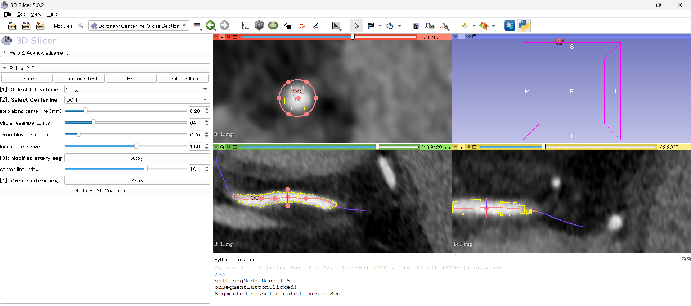
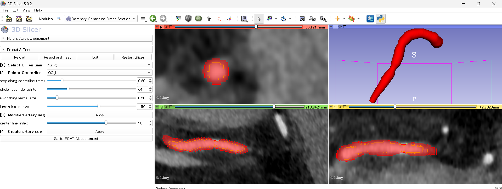
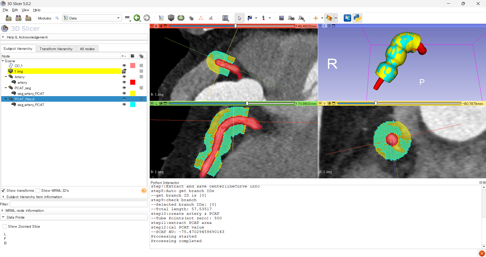
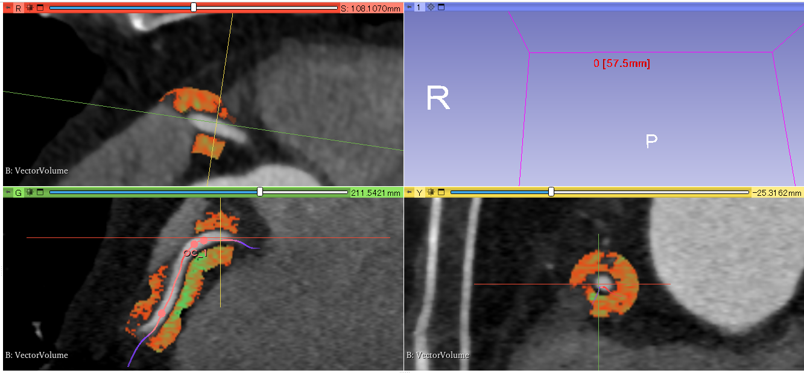

# PcatMeasure Extension for 3D Slicer
Peri-Coronary Adipose Tissue (PCAT) Measurement Tool

## Overview

This extension provides PCAT (Peri-Coronary Adipose Tissue) attenuation measurement
based on coronary centerlines.

## Included Modules
* PcatMeasure
* CoronaryCenterlineCrossSection

## Requirements

* 3D Slicer 5.0.2
* Vascular Modeling Toolkit (VMTK) extension (bundled with Slicer)

## Installation

### From GitHub (Development version)

1. Clone this repository:
   ```bash
   git clone https://github.com/hattori222yu/PcatMeasureExtension.git
2.Launch 3D Slicer.

3.Open Edit → Application Settings → Modules.

4.Add the following paths:

5.PcatMeasureExtension/PcatMeasure

6.PcatMeasureExtension/CoronaryCenterlineCrossSection

7.Restart 3D Slicer.

Supported version

3D Slicer 5.x (tested with 5.0.2)- The version in which slicerVMTK is installed correctly.
## Usage

### CoronaryCenterlineCrossSection

If you do not have a coronary artery segmentation, you can use this module to create a vessel segmentation for the analysis region of interest.

1. In step [1], select a coronary CT angiography image.

2. Manually create a simple centerline of the coronary artery branch to be analyzed using the Markups > Curve.Note that the start point of the analysis range will be the start point of this curve.Once created, select [2].

3. If necessary, adjust the following parameters before proceeding:
   - **Step along centerline**:  
     The interpolation interval between cross-sections along the centerline.
     A cross-sectional segmentation is generated at each centerline point.
   - **Circle resample points**:  
     The number of points used to generate a closed circular contour
     representing the vessel cross-section (default is 64 points).
   - **Smoothing kernel size**:  
     Controls the strength of morphological smoothing applied to the segmentation. Larger values produce smoother boundaries but may remove fine details.
   - **Lumen kernel size**:  
     Coefficient of how large a circle to make from the initial simple threshold-based coronary artery segmentation (default is 1.5).
   - **threshold**:  
     This is a simple initial segmentation of the coronary arteries. It is a simple thresholding process. Please adjust it if the image is poor.

4. Click **Apply** in step [3] to generate cross-sectional views of the coronary
   artery along the centerline.  
   Adjust each of the control points so that the contour fully includes the
   outer vessel wall.

5. In the Red slice view, scroll using the mouse wheel or move the centerline
   index slider to navigate along the centerline.  
   Review and adjust the contour at every centerline point.
   Each cross-section should be checked at least once.

6. By executing step [4], a corrected coronary artery segmentation is generated
   along the entire centerline based on the edited cross-sections.

7. Click **Go to PCAT Measurement** to proceed to the PCAT analysis module.


### PcatMeasure

This module requires a contrast-enhanced coronary CT image and a segmentation
of the coronary artery to be analyzed. 
 
PCAT attenuation was calculated as the mean CT value within the range of **–190 HU to –30 HU** over an area outside three times the vessel radius.

For easier analysis, it is recommended that the coronary artery segmentation
is separated into left and right coronary arteries.

If you have coronary artery segmentation obtained by deep learning, etc., you can measure PCAT using only this module. In that case, please use the "Manual starting point" button in the options to set the origin of the coronary artery on the coronary CT image or the starting point of the analysis.


1. **Load data from** 
   Select the data source using the checkbox.  
   By default, data are loaded from the current Scene. 
   If unchecked, a file dialog will open to load data from disk.

2. **Segment data** 
   Please select whether the segmentation data you are analyzing has branches.
   If it comes from the CoronaryCenterlineCrossSection module, Single is OK. 
   If you have branched segmentation, please select Branched.

3. **Target coronary artery** 
   Select the coronary branch to be analyzed.

4. **Select CT Volume** and **Select Segmentation** 
   Select the CT volume and the coronary artery segmentation.  
   If this module is opened using the **Go to PCAT** button from
   *CoronaryCenterlineCrossSection*, these fields are automatically populated.

5. Click **[1] Get CT Node**.

6. If necessary, use the slider to define the **PCAT range**.
   Default ranges are:
   - **RCA**: 10.0–50.0 mm  
   - **LAD / LCX**: 0.0–40.0 mm

7. Click **[2] Select branches** to extract a high-precision coronary centerline.  
   The checked branch will be used for analysis.  
   If multiple branches are present, select the branch ID corresponding to
   the target vessel and confirm that the extracted centerline length is
   sufficient for analysis.

8. Click **[3] Analysis PCAT** to generate the PCAT region segmentation
   and perform PCAT analysis.  
   The PCAT values are displayed in the Python Interactor and saved as a `.csv`
   file in the output directory.

#### Options

- **Show PCAT inflammation**  
  Generates a color-mapped visualization of the PCAT region.

- **Manual starting point**  
  On the coronary CT image, set the origin of the coronary artery or the starting point to be analyzed.s

- **Reset slicer views**  
  Restores reformatted slice views to their original state.

- **Clear All**  
  Removes all data from the Scene.

- **Clear (except CT)**  
  Removes all data except the CT volume from the Scene.  
  This is useful when analyzing RCA first and then proceeding to LAD or LCX.

- **Back to Coronary Centerline Cross Section**  
  Returns to the *CoronaryCenterlineCrossSection* module to start a new analysis.

## Screenshots






## Known Limitations

- This module is intended for research use only.
- If you do not have a coronary artery segmentation, you must manually create the centerline and then create the segmentation.
- PCAT analysis assumes contrast-enhanced coronary CT.
- Results may vary depending on image quality and segmentation accuracy.

## Disclaimer

This software is intended for research purposes only and is not approved for
clinical use.

## Authors

- Masayuki Hattori, Yamagata University Hospital, Japan
- Daisuke Kinoshita, Yamagata University Hospital, Japan


## Citation

If you use this extension in academic work, we would appreciate citation of the following manuscript, which is currently under review:

Hattori M, et al.
Development and validation of a pericoronary adipose tissue attenuation analysis system.
Manuscript under review.

Also please cite the 3D Slicer platform and the Vascular Modeling Toolkit (VMTK).

## Acknowledgements


This extension incorporates and modifies portions of the

`ExtractCenterline` module from the 3D Slicer Vascular Modeling Toolkit (VMTK).


Original authors:

\- Andras Lasso (PerkLab)

\- Daniel Haehn (Boston Children's Hospital)

\- Luca Antiga (Orobix)

\- Steve Pieper (Isomics)


The original implementation is part of the 3D Slicer project and is

distributed under the 3D Slicer License.

## License

This extension is distributed under the same license as 3D Slicer.

3D Slicer is licensed under a BSD-style open source license.

See: https://www.slicer.org/pages/License
